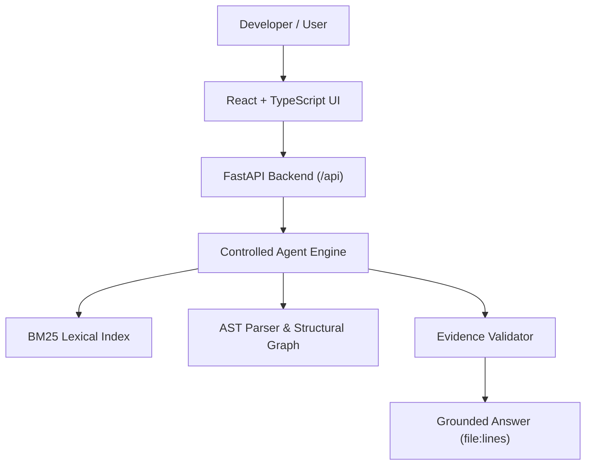

# PRISM Agentic Code Intelligence - Architecture Specification

Theme 1 prototype for Samsung PRISM Gen AI Hackathon 3.0.

## Overview

PRISM Agentic Code Intelligence provides an evidence-based developer assistant for exploring unfamiliar Python codebases.

## System Components

1. **Ingestion & AST Parser (`backend/app/ingestion/`)**
   - Safe, sandboxed repository loading.
   - AST parsing to extract symbols (functions, classes, calls, imports, docstrings).

2. **Lexical Retrieval (`backend/app/retrieval/`)**
   - BM25 index over code lines/chunks for keyword fallback search.

3. **Structural Graph (`backend/app/graph/`)**
   - Call graph builder with explicit relationship certainty (`DIRECT`, `STATIC_INFERENCE`, `UNRESOLVED`).

4. **Agent & Controlled Tools (`backend/app/agent/`)**
   - Strictly restricted tool execution environment (read-only file bounds, AST queries, BM25 search).
   - Abstraction for LLM providers (Mock LLM for offline tests, Gemini/OpenAI for live runs).

5. **Evidence Validation (`backend/app/validation/`)**
   - Re-verifies source file path, line bounds, and snippet content to prevent hallucinated facts.

6. **API Gateway (`backend/app/api/`)**
   - FastAPI REST endpoints including `/health` and future investigation routes.
